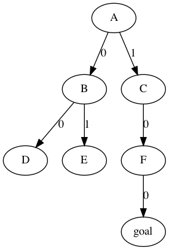

上図の例のような木構造が与えられます。
各ノードは最大で2個の子ノードを持っています。

ノードのなかに1つだけゴールとなるノードがあります。
根のノード(上図ではA)から子ノードを辿っていき、ゴールのノードを見つけるのが課題です。

各ノードに対応する関数を次のように定義します。

| 引数 | 返値 |
| --- | --- |
| `0` | 子ノードが存在すれば、0番目の子ノードに対応する関数を返す。存在しなければ`null`を返す。 |
| `1` | 子ノードが2個存在すれば、1番目の子ノードに対応する関数を返す。存在しなければ`null`を返す。 |
| `"goal"` | ゴールのノードでなければ`null`を返す。ゴールのノードであれば`null`以外の値を返す。 |
| それ以外 | 値を返さない。誤答となる。 |

根のノードに対応する関数`root`が引数で与えられます。
ゴールのノードに対応する関数の引数に`"goal"`を与えて呼び出したときの返値を返す関数を作成してください。

上の例では
```js
return root(1)(0)(0)("goal");
```
とすれば正答になります。